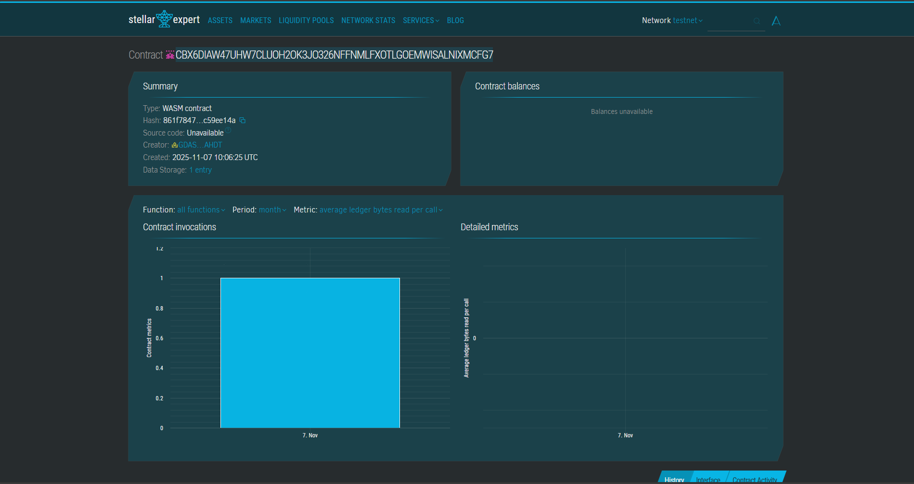

# Supply Chain Tracker

## Project Title
**Supply Chain Tracker on Stellar Blockchain**

## Project Description
The Supply Chain Tracker is a decentralized supply chain management system built on the Stellar blockchain using Soroban smart contracts. This solution enables transparent and immutable tracking of products throughout their entire lifecycle, from manufacturing to delivery. By leveraging blockchain technology, stakeholders can verify product authenticity, monitor shipment status, and maintain a tamper-proof record of the entire supply chain journey.

The smart contract provides core functionality for registering new products, updating their status and location as they move through the supply chain, and retrieving product information at any point in time. This creates unprecedented transparency and accountability in supply chain operations.

## Project Vision
Our vision is to revolutionize supply chain management by creating a trustless, transparent, and efficient system that eliminates fraud, reduces costs, and builds consumer confidence. By utilizing Stellar's fast and low-cost blockchain infrastructure, we aim to make enterprise-grade supply chain tracking accessible to businesses of all sizes.

We envision a future where:
- Every product can be traced from origin to consumer
- Counterfeit goods are easily identified and eliminated
- Supply chain inefficiencies are reduced through real-time visibility
- Trust between manufacturers, distributors, retailers, and consumers is strengthened
- Global trade becomes more transparent and accountable

## Key Features

### 1. **Product Registration**
- Register new products entering the supply chain
- Assign unique blockchain-based product IDs
- Record manufacturer information and initial location
- Timestamp creation on the immutable ledger

### 2. **Real-Time Status Updates**
- Update product location as it moves through the supply chain
- Track status changes (manufactured → in transit → delivered)
- Automatic timestamping of every update
- Maintain complete audit trail

### 3. **Product Information Retrieval**
- Query product details using unique product ID
- Access complete history including manufacturer, locations, and status
- View timestamp information for every update
- Transparent and verifiable data for all stakeholders

### 4. **Analytics and Reporting**
- Track total number of products registered
- Monitor supply chain metrics
- Generate insights from blockchain data

### 5. **Decentralized and Immutable**
- All data stored on Stellar blockchain
- Tamper-proof records
- No single point of failure
- Trustless verification

## Future Scope

### Short-term Enhancements
- **Multi-party Authorization**: Implement role-based access control for manufacturers, distributors, and retailers
- **Batch Processing**: Enable registration and updates for multiple products simultaneously
- **Event Notifications**: Trigger alerts when products reach specific milestones or locations
- **QR Code Integration**: Generate unique QR codes for easy product scanning and verification

### Medium-term Developments
- **IoT Integration**: Connect with IoT sensors for automated location and condition tracking (temperature, humidity, etc.)
- **Advanced Analytics Dashboard**: Build comprehensive analytics platform with visualizations
- **Compliance Verification**: Integrate regulatory compliance checks at each supply chain stage
- **Smart Contracts for Payments**: Automate payments upon delivery confirmation

### Long-term Vision
- **Cross-chain Interoperability**: Enable integration with other blockchain networks
- **AI-Powered Predictive Analytics**: Implement machine learning for demand forecasting and route optimization
- **Sustainability Tracking**: Add carbon footprint calculation and environmental impact monitoring
- **Consumer Mobile App**: Develop end-user application for product verification and traceability
- **Global Supply Chain Network**: Create a universal standard for supply chain tracking across industries
- **NFT-based Certificates**: Issue authenticity certificates as NFTs for luxury and high-value goods

### Industry Expansion
- **Pharmaceutical Tracking**: Specialized features for drug authentication and cold chain monitoring
- **Food Safety**: Farm-to-table tracking with expiration date management
- **Luxury Goods Authentication**: Enhanced features for combating counterfeiting
- **Automotive Parts**: Track genuine parts and prevent grey market distribution

---

## Technical Stack
- **Blockchain**: Stellar Network
- **Smart Contract Platform**: Soroban SDK
- **Language**: Rust
- **Storage**: On-chain instance storage with TTL management

## Getting Started

### Prerequisites
- Rust toolchain installed
- Soroban CLI installed
- Stellar account with testnet XLM

### Build and Deploy
```bash
# Build the contract
soroban contract build

# Deploy to Stellar testnet
soroban contract deploy \
  --wasm target/wasm32-unknown-unknown/release/supply_chain_tracker.wasm \
  --network testnet

# Interact with the contract
soroban contract invoke \
  --id <CONTRACT_ID> \
  --network testnet \
  -- register_product \
  --name "Product Name" \
  --manufacturer "Manufacturer Name" \
  --location "Factory Location"
```

## Contributing
We welcome contributions from the community! Please feel free to submit issues, feature requests, or pull requests.

## License
MIT License

## Contract Details
Contract ID:CBX6DIAW47UHW7CLUOH2OK3JO326NFFNMLFXOTLGOEMWISALNIXMCFG7
